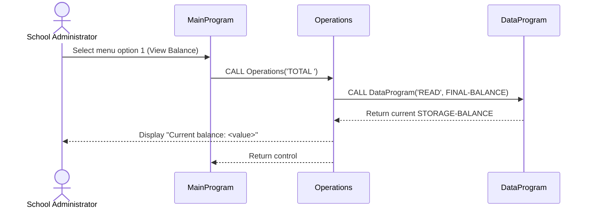
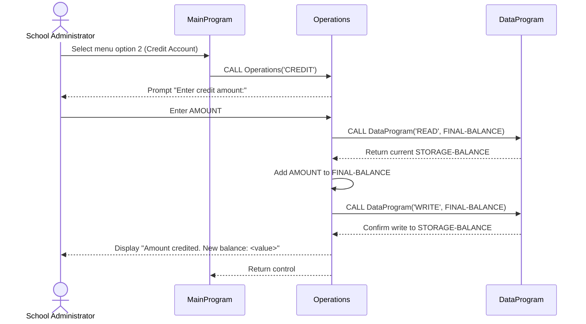
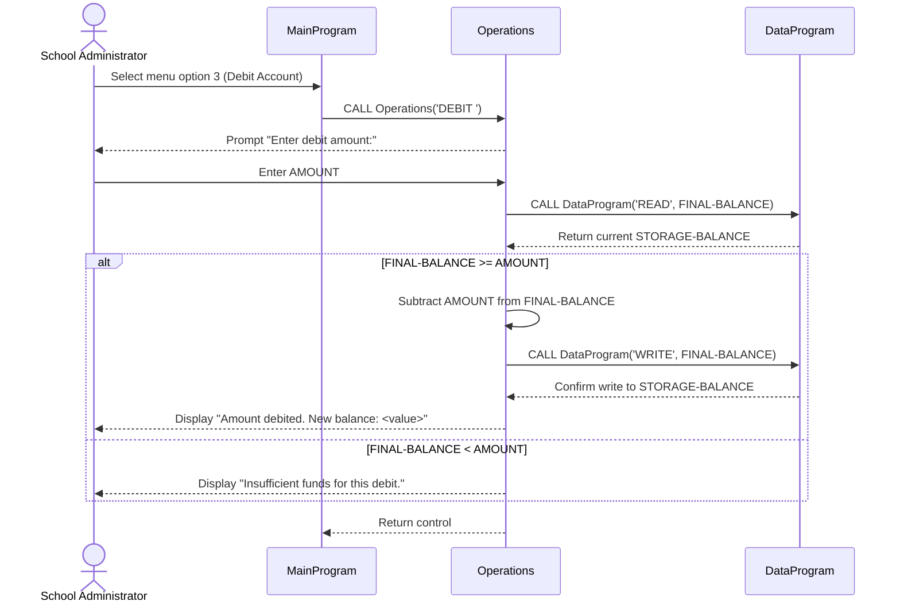
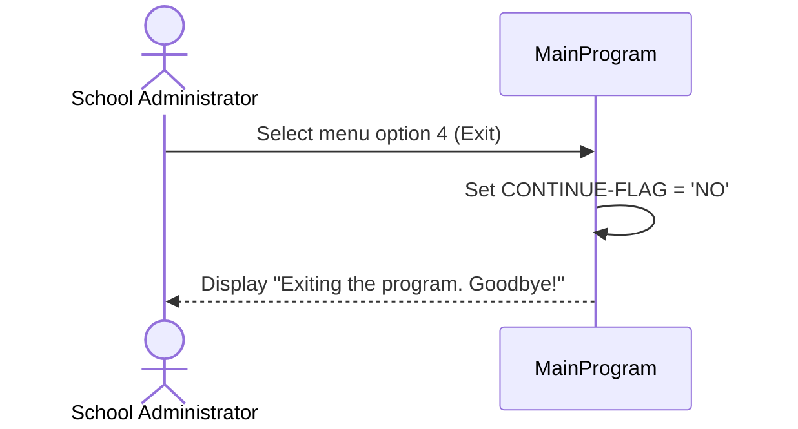

# School Account Management System Specification

## Purpose
This specification defines the expected behavior of the school account management system used to view a student account balance, apply credits, and apply debits.

This document is written for school administrators and is the authoritative source of truth for modernization and replacement implementations.

## 1. System Overview

### What the system does
The system manages one monetary balance and allows a user to:
- View the current balance
- Add money to the balance (credit)
- Subtract money from the balance (debit), only when enough funds are available
- Exit the application

### Who uses it
The intended user is a school administrator (for example, office or finance staff) operating a text-based menu.

### Scope and storage model
- The system tracks a single balance value at runtime.
- The starting/default balance is 1000.00.
- Balance data is kept in program memory and is not persisted to disk or database in this legacy implementation.
- When the program is restarted, balance returns to the default value unless persistence is added in a future system.

## 2. Data Structures

### 2.1 Core Financial Data

| Data Element | Technical Type | Business Meaning | Constraints | Default |
|---|---|---|---|---|
| STORAGE-BALANCE | Decimal numeric `9(6)V99` | Authoritative stored account balance | 6 integer digits and 2 decimal digits; maximum 999999.99; minimum is functionally prevented from going below 0.00 by debit rule | 1000.00 |
| FINAL-BALANCE | Decimal numeric `9(6)V99` | Working copy of balance used during operations | Same numeric format as stored balance | 1000.00 |
| AMOUNT | Decimal numeric `9(6)V99` | User-entered transaction amount for credit/debit | 6 integer digits and 2 decimal digits; no explicit validation for zero/negative value in legacy logic | No explicit default before input |
| BALANCE (linkage) | Decimal numeric `9(6)V99` | Value passed between programs when reading/writing balance | Same numeric format as stored balance | Passed by caller |

### 2.2 Operation and Control Data

| Data Element | Technical Type | Business Meaning | Allowed/Observed Values | Default |
|---|---|---|---|---|
| USER-CHOICE | Numeric `9` | Menu option selected by user | 1, 2, 3, 4 are valid; other values rejected | 0 |
| CONTINUE-FLAG | Text `X(3)` | Controls whether menu loop continues | `YES` to continue, `NO` to exit | `YES` |
| OPERATION-TYPE (main/operations/data) | Text `X(6)` | Internal operation code used to route behavior | `TOTAL `, `CREDIT`, `DEBIT `, `READ`, `WRITE` | No explicit default in all programs |
| PASSED-OPERATION | Text `X(6)` | Operation code passed between programs | Same as above | Passed by caller |

### 2.3 Program Components and Responsibilities

| Component | Responsibility |
|---|---|
| MainProgram | Shows menu, collects user choice, dispatches selected operation, controls exit |
| Operations | Executes requested business operation (view total, credit, debit) |
| DataProgram | Reads and writes authoritative stored balance |

## 3. Business Rules

### Rule BR-01: Menu selection must be valid
- Valid choices are 1 through 4.
- Any other choice shows an error message and returns to the menu.

### Rule BR-02: View Balance must read from current stored balance
- Balance display must reflect the value currently stored by the data component.

### Rule BR-03: Credit increases balance by entered amount
- The system reads current balance, adds the entered amount, writes updated balance, and displays the new balance.

### Rule BR-04: Debit cannot exceed current balance
- Debit is only allowed when current balance is greater than or equal to the requested debit amount.
- If debit amount is greater than current balance, no update is performed and an insufficient funds message is shown.

### Rule BR-05: Exit ends session loop
- Choosing option 4 sets the continue flag to `NO` and ends the program with a goodbye message.

### Rule BR-06: Stored balance is session-scoped in legacy system
- Stored balance exists in memory during execution.
- Restarting the application resets balance to default 1000.00.

## 4. Operations

### 4.1 Operation: View Balance

#### Purpose
Allow the administrator to see the current account balance.

#### Required inputs
- Menu choice: `1`

#### Expected outputs
- Display message: current balance value

#### Step-by-step behavior
1. User selects option 1 in the main menu.
2. Main menu sends operation code `TOTAL ` to Operations.
3. Operations requests current stored balance from DataProgram using `READ`.
4. DataProgram returns current balance value.
5. Operations displays `Current balance: <value>`.
6. Control returns to main menu.

#### Error conditions and handling
- No operation-specific error handling is implemented for read failures because storage is in-memory and local in the legacy implementation.

### 4.2 Operation: Credit Account

#### Purpose
Increase the current account balance by a user-provided amount.

#### Required inputs
- Menu choice: `2`
- Credit amount (numeric, decimal up to two places)

#### Expected outputs
- Updated balance persisted to session memory
- Display message confirming credit and showing new balance

#### Step-by-step behavior
1. User selects option 2 in the main menu.
2. Main menu sends operation code `CREDIT` to Operations.
3. Operations prompts user: `Enter credit amount:`.
4. User enters amount.
5. Operations reads current stored balance from DataProgram (`READ`).
6. Operations adds entered amount to current balance.
7. Operations writes updated balance to DataProgram (`WRITE`).
8. Operations displays `Amount credited. New balance: <value>`.
9. Control returns to main menu.

#### Error conditions and handling
- No explicit validation exists for zero or negative credit amounts in legacy logic.
- No explicit user-friendly handling exists for invalid (non-numeric) amount input in legacy logic.

### 4.3 Operation: Debit Account

#### Purpose
Decrease the current account balance by a user-provided amount when funds are sufficient.

#### Required inputs
- Menu choice: `3`
- Debit amount (numeric, decimal up to two places)

#### Expected outputs
- If funds sufficient: updated balance persisted to session memory and confirmation message
- If funds insufficient: no balance change and insufficient funds message

#### Step-by-step behavior
1. User selects option 3 in the main menu.
2. Main menu sends operation code `DEBIT ` to Operations.
3. Operations prompts user: `Enter debit amount:`.
4. User enters amount.
5. Operations reads current stored balance from DataProgram (`READ`).
6. System compares current balance and debit amount.
7. If current balance is greater than or equal to debit amount:
   - Subtract debit amount from current balance.
   - Write updated balance to DataProgram (`WRITE`).
   - Display `Amount debited. New balance: <value>`.
8. Otherwise:
   - Do not write any update.
   - Display `Insufficient funds for this debit.`
9. Control returns to main menu.

#### Error conditions and handling
- Insufficient funds is explicitly handled with message and no balance update.
- No explicit validation exists for zero or negative debit amounts in legacy logic.
- No explicit user-friendly handling exists for invalid (non-numeric) amount input in legacy logic.

### 4.4 Operation: Exit

#### Purpose
Terminate the user session.

#### Required inputs
- Menu choice: `4`

#### Expected outputs
- Loop ends
- Display message: `Exiting the program. Goodbye!`

#### Step-by-step behavior
1. User selects option 4.
2. Main program sets continue flag to `NO`.
3. Loop terminates.
4. Program displays goodbye message and stops.

#### Error conditions and handling
- None specific.

## 5. User Interface Flow

### 5.1 Menu Structure
The system presents this menu repeatedly until the user exits:
- Account Management System
- 1. View Balance
- 2. Credit Account
- 3. Debit Account
- 4. Exit

Prompt shown each cycle:
- `Enter your choice (1-4):`

### 5.2 Interaction Flow
1. System starts and initializes control variables.
2. Menu is displayed.
3. User enters a choice.
4. System evaluates choice:
   - `1` -> View Balance flow
   - `2` -> Credit flow
   - `3` -> Debit flow
   - `4` -> Exit flow
   - Other -> Display invalid choice message and return to menu
5. After each non-exit operation, control returns to menu.
6. On exit, system displays goodbye message and terminates.

## 6. Ambiguities and Review Items for Domain Verification

The following behaviors are present in legacy code and should be reviewed by school/finance stakeholders before modernization:

1. Negative or zero amounts:
- Legacy code does not explicitly block negative or zero values for credit/debit.
- Business policy should define whether these are allowed.

2. Input validation behavior:
- Legacy code does not include explicit end-user validation messages for non-numeric amount input.
- Modern replacement should define required validation and error messaging standards.

3. Single shared balance model:
- Legacy implementation manages one balance value, not multiple students/accounts.
- Stakeholders should confirm whether modern system requires per-student account records.

4. Persistence requirement:
- Legacy balance resets on restart.
- Modern replacement should define persistence requirements (database, audit, recovery).

## References
- Source analysis: `src/cobol/main.cob`
- Source analysis: `src/cobol/operations.cob`
- Source analysis: `src/cobol/data.cob`
- Methodology: SpecOps instructions in `AGENTS.md`

## 7. System Diagrams

### 7.1 View Balance (Option 1)

### 7.2 Credit Account (Option 2)

### 7.3 Debit Account (Option 3)

### 7.4 Exit (Option 4)

